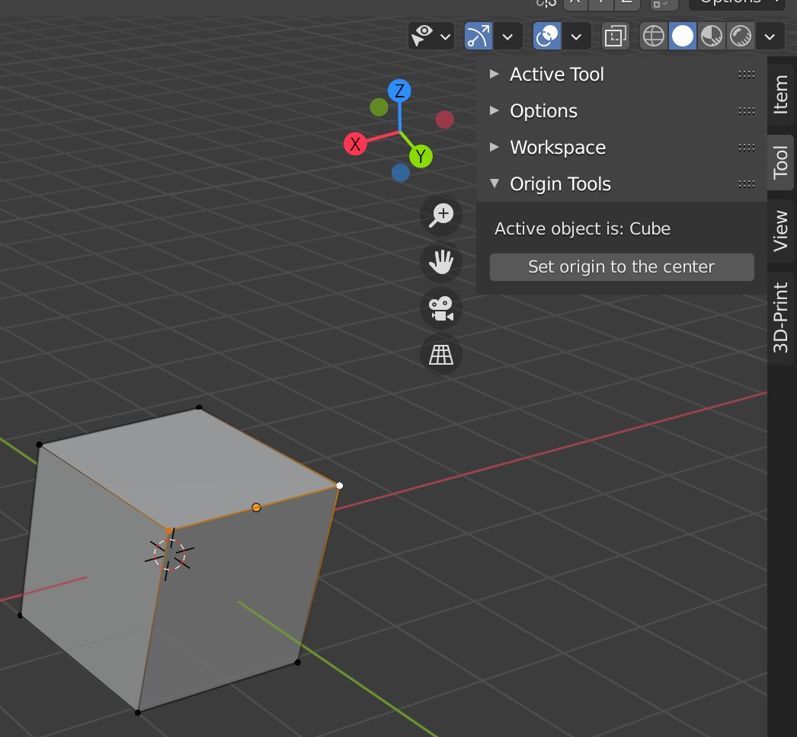

# BlenderAddon-Tools
some handy tools for 3D-printing modeling

## installation
- Download the source code(and unzip it) or git-clone it
- Go to "Preferences..." in blender
- Click "Add-ons" Tab, click "Install..." on the top-right corner
- In the FileSelector/Picker/Whatsoever, select "precise_tools.py" in source code folder,
    then enable it.

#### origin point tools: located in N-key-panel

